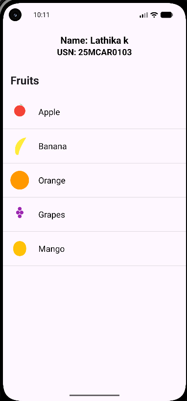
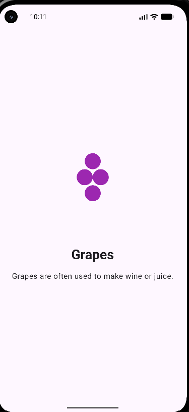

# Adaptive ListView App

## 📱 Project Overview

Adaptive ListView App is an Android application developed using **Android Studio**. It demonstrates an adaptive user interface using **SlidingPaneLayout** and **ListView**.

The application displays a list of fruits on the left side and shows the selected fruit's image, name, and description on the detail pane.

## ✨ Features

- Adaptive two-pane layout
- ListView for displaying fruits
- Fruit image and details
- SlidingPaneLayout for adaptive UI
- Student Name and USN displayed at the top
- Simple and user-friendly interface

## 🛠️ Technologies Used

- Android Studio
- Kotlin
- XML
- Android SDK
- SlidingPaneLayout
- ListView
- ImageView
- TextView

## 📂 Project Structure

```text
Adaptive-ListView-App/
├── app/
├── gradle/
├── Screenshort/
│   ├── output1.png
│   └── output2.png
├── .gitignore
├── build.gradle.kts
├── gradle.properties
├── gradlew
├── gradlew.bat
└── settings.gradle.kts
```

## 🖼️ Screenshots

### Output 1



### Output 2



## ▶️ How to Run

1. Clone the repository.
2. Open the project in Android Studio.
3. Wait for Gradle synchronization to complete.
4. Connect an Android device or start an Android Emulator.
5. Click **Run** in Android Studio.
6. Select the application and view the Adaptive ListView App.

## 🔗 GitHub Repository

[Adaptive ListView App](https://github.com/Lathika-kathirvel/Adaptive-ListView-App)

## 📌 Conclusion

The Adaptive ListView App demonstrates the implementation of an adaptive Android interface using ListView and SlidingPaneLayout. Users can select a fruit from the list and view its corresponding details in the detail pane.
